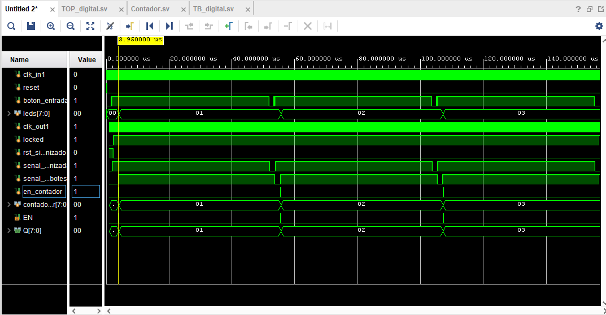

# Módulos utilizados para la implementación del sistema de anti rebote de forma digital.

## a) Filtro anti rebote:

  Está parte es física, se implemento por medio de un LMC555, para mayor estabildiad y que no tenga tanto ruido al pulsar el botón.
  

## b) Sincronizador:

  En sí la señal al provenir de un botón que es un instrumento asincrónico, es necesario sincronizarlo para que este funcione correctamente en la FPGA. Esto se logra utilizando dos flip-flop en serie, el primero se encarga de tomar la señal asincrónica, y el segundo la entrega ya estabilizada al dominio del reloj. Con esto se asegura que la señal queda sincronizada con el reloj.

## c) Detector de flanco:

  Se utiliza para que detecte el flanco de subida, de la señal de anti rebote y genere un pulso corto, se utiliza para el contador.

## d) Contador de pruebas:

  Cuenta el número de pulsos limpios que llegan desde el módulo de anti rebote, permitiendo comprobar una pulsación realizando un incremento al contador, luego si no hay incrementos extras, lo que permite confirmar que el anti rebote funciona como debería.

## e) Utilización del IP Catal (Clock Wizard):

  Ya el módulo esta guardado con las especificaciones necesarias, antes de correr el programa, es necesario ir a source, buscar el que tenga el nombre de clk_wiz, se debe dar click derecho y en Re-Custimize y darle  darle OK, luego click derecho y luego en # Generate Outputs Productos, para que genere todo lo necesario para que lo demás funcione.

## f)El module top:

  Es utilizado para realizar todas las conexiones necesarias 

# Resultados importantes 

Se debe mencionar que se realiza un testbench para el módulo top. Para obtener todos los resultados fue neceesario utiliza run -all, para ejecutar todo de forma correcta.

Este es un zoom de una de las partes para lograr ver cómo interactúa todo de forma más concreta.

Y este ya sería el resultado total, donde solo se realizaron 3 pulsaciones del botón porque mi computadora no soporta más que eso, pero si es posible de realizar para ver todo el proceso.
