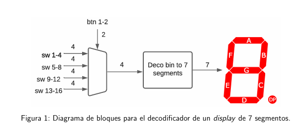

# 4.3. Ejercicio 3. Decodificador para display de 7 segmentos
1. Revise la documentaci´on de la tarjeta Digilent Nexys4 sobre el módulo de 7 segmentos
incluido.
2. Desarrolle un registro parametrizable, de entrada y salida paralela, y con write enable
(WE).
3. Por medio de los dos bloques anteriores, desarrolle un sistema, como el mostrado en la
Figura 2, que permita mostrar en los display de 7 segmentos el contenido de un registro de
16 bits.
4. Escriba un bloque de pruebas que genere datos pseudo-aleatorios (considere implementar,
o utilizar, un LFSR - Linear-Feedback Shift Register) aproximadamente cada 2 segundos y
los escriba en el registro de 16 bits.
5. Escriba un testbench para su sistema, asegúrese de realizar las simulaciones post-síntesis y
post-implementación. Puede ajustar el tiempo de generación de números pseudo-aleatorios
para reducir el tiempo de simulación.
6. Descargue el diseño a la tarjeta con FPGA y verifíquelo. Asegúrese de asignar apropiadamente las señales a las entradas y salidas del chip de FPGA a los dispositivos conectados.

# Objetivo 
Desarrollar un bloque decodificador de hexadecimal (4 bits) a un display de 7 segmentos.

# Planteamiento de la solución
Diseñar un decodificador 4→7 para display de 7 segmentos que muestre valores hexadecimales (0..F). Donde por medio de los 16 interruptores del la tarjeta Nexy 4 organizarmos en 4 grupos de 4 (cada grupo = un nibble) y, usando 2 botones, seleccionar cuál de las 4 entradas mostrar en el display mediante multiplexado.

## Entradas:
Los interruptores de la NExy 4 que esta bajo el nombre sw[15:0] 
Entonces son 16 interruptores organizados en 4 grupos: sw[3:0], sw[7:4], sw[11:8], sw[15:12])
También contamos con los botones del la tarjeta btn[1:0] de manera que son dos botones.

## Salidas:
La tarjeta trae incluido como periferico un seg[6:0] donde se debe de mostrar por medio de la uluminción de los leds las variables de salida.
Tmabién se debe de tomar en cuenta el an[3:0] (anodos/cátodos de los 4 dígitos si tu display físico), estos se ilumina si es activa la salidaa.

# Tabla de verdad para el 7 segmento. 

| Entrada (Hex) | Entrada binaria | Segmentos `{a,b,c,d,e,f,g}` | 
| ------------- | --------------- | --------------------------- | 
| 0             | 0000            | 1111110                     | 
| 1             | 0001            | 0110000                     | 
| 2             | 0010            | 1101101                     |
| 3             | 0011            | 1111001                     | 
| 4             | 0100            | 0110011                     | 
| 5             | 0101            | 1011011                     | 
| 6             | 0110            | 1011111                     | 
| 7             | 0111            | 1110000                     | 
| 8             | 1000            | 1111111                     | 
| 9             | 1001            | 1111011                     | 
| A             | 1010            | 1110111                     | 
| B             | 1011            | 0011111                     | 
| C             | 1100            | 1001110                     | 
| D             | 1101            | 0111101                     | 
| E             | 1110            | 1001111                     | 
| F             | 1111            | 1000111                     | 

## Planteamiento de la solución del ejercicio.

## Decodificación hexadecimal de 7segmento
Se recibe un número de 4 bits que van de 0 a F en hexadecimal, y enciende los segmentos correctos en el display. De manera que se va hacer una cuenta en aumento en el display. 

Decodificador Hex→7 segmentos:
Convierte un valor hexadecimal de 4 bits en las señales necesarias para encender los segmentos del display y representar los dígitos del 0 al F.

## Registro de 16 bits con WE
Este es para generar un registro de un pulso en WE=1, guarda el valor de entrada en un parametro de D[15:0] y lo mantiene en una señal de salida de Q[15:0].

Esto se da por medio de cambios de la señal WE para verificar que la señal guardad en D al ser activada se de la salida en Q.
Registro parametrizable con WE (Write Enable):
Almacena valores de 16 bits (4 dígitos hexadecimales). Solo se actualiza cuando se activa la señal de escritura.

También para tener el control en esto cambios y que se refleje correctamente en el display, se debe de emplear un controlador de displays con un multiplexor, el cuál recibe los 16 bits del registro, dodne se selecciona un nibble de 4 bits a la vez, por cada señal. 
Por medio del decodificador se convierte en un nibble en segementos. Se debe de tener el cuidado de que la velocidad de cambio de la señal de reloj se mantenga bien sincronizado ya que el promedio de cambio es de 1K Hz.

## Generador de números pseudo-aleatorios (LFSR)
Este generador produce la secuencia del pseudo-aleatoria de 16 bits, por medio de la señal de control. También se puede emplear un temporizador para divir el reloj de la FPGA en unos 100M Hz, por cada pulso de 2 segundos.

## Integración del codigo en un TOP.
Tenemos 4 bloques que conforma el top:
1. El LFSR genera el número aleatorio.
2. Un temporizador para la señal de WE cada 2 segundos.
3. Un registro para guardar el numero de D que va a Q.
4. Por ultimo el contador de display el cual será la señal de muestra el contenido del registro en los 4 digitos.

# Solución del problema.
